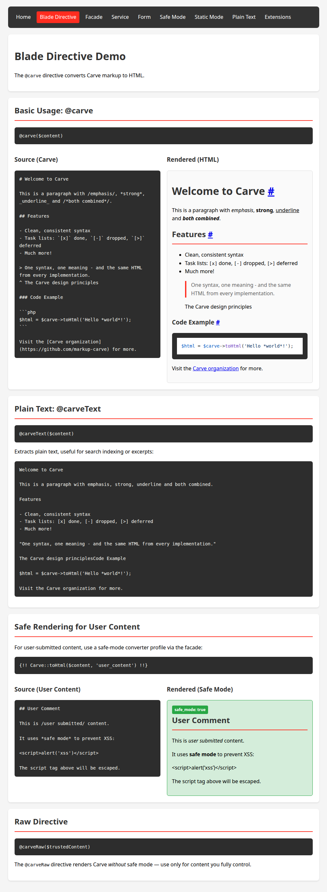
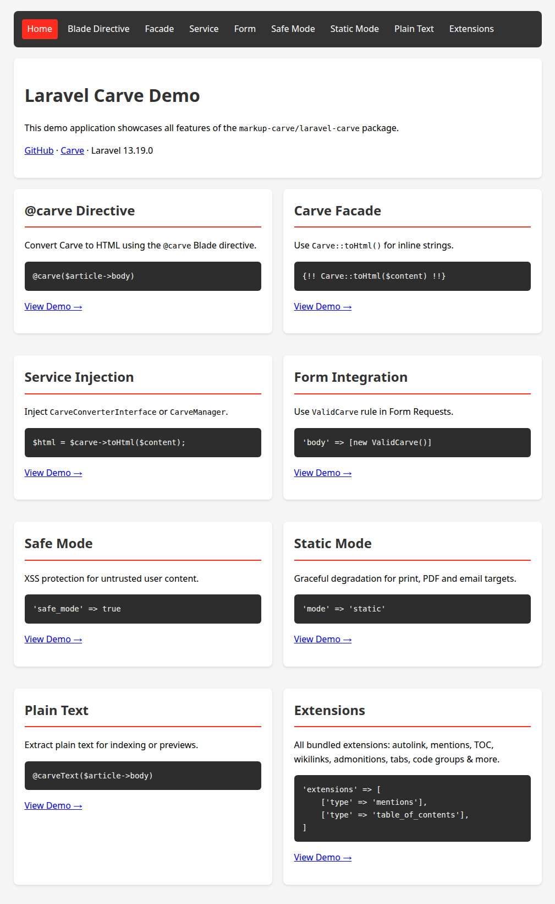

# Laravel Carve Demo

A demo application showcasing all features of the [markup-carve/laravel-carve](https://github.com/markup-carve/laravel-carve) package.



## Requirements

- PHP 8.2+
- Composer

## Installation

```bash
# Clone the repository
git clone https://github.com/markup-carve/laravel-carve-demo.git
cd laravel-carve-demo

# Install dependencies
composer install
```

The `post-create-project-cmd` scripts already generate an app key and create the SQLite database file; if you clone instead of using `composer create-project`, run these manually:

```bash
cp .env.example .env
php artisan key:generate
touch database/database.sqlite
php artisan migrate --graceful
```

## Running the Demo

```bash
php artisan serve
```

Then open <http://127.0.0.1:8000> in your browser.

## Screenshots

**Home** — overview of all features:



**Blade Directive** demo (shown at the top of this README) — `@carve`, `@carveRaw`, `@carveText` usage with side-by-side source/rendered output.

## Demo Pages

| Route | Description |
|-------|-------------|
| `/` | Home — overview of all features |
| `/blade-directive` | Using the `@carve` / `@carveRaw` / `@carveText` Blade directives |
| `/facade` | Using the `Carve` facade for inline rendering |
| `/service` | Injecting `CarveConverterInterface` and `CarveManager` into services |
| `/form` | Form validation with the `ValidCarve` rule |
| `/safe-mode` | XSS protection for untrusted content |
| `/plain-text` | Extracting plain text for search/excerpts |
| `/extensions` | Live demo of all configured Carve extensions |

## Features Demonstrated

### Blade Directives

```blade
{{-- Safe (XSS-protected) render --}}
@carve($article->body)

{{-- Trusted content, no safe mode --}}
@carveRaw($trustedContent)

{{-- Plain text, HTML-escaped --}}
@carveText($article->body)
```

### Facade

```blade
{!! Carve::toHtml($content) !!}
{!! Carve::toHtml($userContent, 'user_content') !!}
{{ Carve::toText($content) }}
```

### Service Injection

```php
use MarkupCarve\LaravelCarve\Service\CarveConverterInterface;
use MarkupCarve\LaravelCarve\Service\CarveManager;

class ArticleController
{
    public function __construct(
        private CarveConverterInterface $carve,
        private CarveManager $manager,
    ) {}

    public function show(Article $article): View
    {
        return view('articles.show', [
            'html' => $this->carve->toHtml($article->body),
            'comment_html' => $this->manager->toHtml($article->comment, 'user_content'),
        ]);
    }
}
```

### Validation

```php
use MarkupCarve\LaravelCarve\Rules\ValidCarve;

$request->validate([
    'body' => ['required', 'string', new ValidCarve()],
    'comment' => ['nullable', 'string', new ValidCarve(strict: true)],
]);
```

### Multiple Converter Profiles

```php
// config/carve.php
return [
    'converters' => [
        'default' => [
            'safe_mode' => false,
            'extensions' => [
                ['type' => 'autolink'],
                ['type' => 'smart_quotes'],
                ['type' => 'heading_permalinks'],
            ],
        ],
        'user_content' => [
            'safe_mode' => true,
        ],
        'with_mentions' => [
            'extensions' => [
                [
                    'type' => 'mentions',
                    'user_url_template' => 'https://github.com/{username}',
                ],
            ],
        ],
    ],
];
```

## Extensions Showcased

The demo's converter profiles in `config/carve.php` enable these Carve extensions:

- **Autolink** — Converts bare URLs to links
- **Admonition** — Styled note/tip/warning/danger blocks
- **Code Group** — Tabbed code blocks (`::: code-group`)
- **Default Attributes** — Auto-applied `loading="lazy"`, etc.
- **Details** — Native `<details>`/`<summary>` disclosure blocks (enabled in the static `print` profile)
- **External Links** — `target="_blank"` + `rel` attributes
- **Frontmatter** — YAML/TOML/JSON frontmatter parsing
- **Heading Permalinks** — Anchor links on headings
- **Mentions** — `@username` → profile links
- **Semantic Spans** — `<kbd>`, `<dfn>`, `<abbr>` from span syntax
- **Smart Quotes** — Typographic (curly) quotes
- **Table of Contents** — Generated heading TOC via the `table_of_contents` extension
- **Wikilinks** — `[[Page Name]]` wiki-style links

## Configuration

See `config/carve.php` for the full example configuration covering every profile used by the demo.

## Ecosystem

Part of the [Carve organization](https://github.com/markup-carve). See
[awesome-carve](https://github.com/markup-carve/awesome-carve) for the full
list of implementations, editor plugins and integrations.
